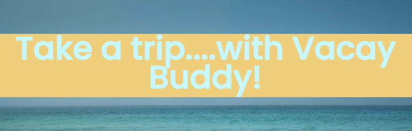
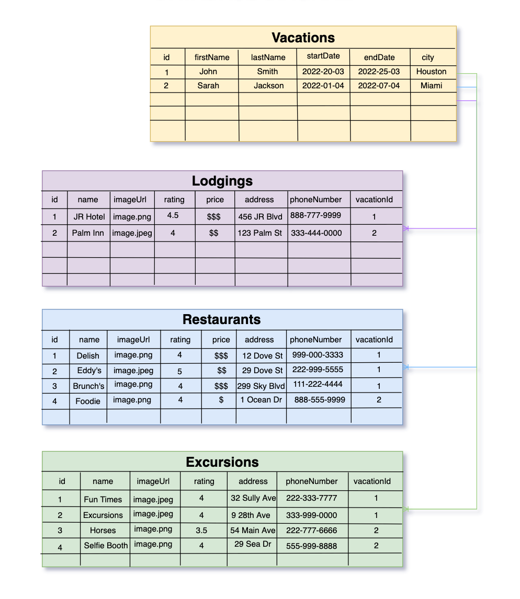
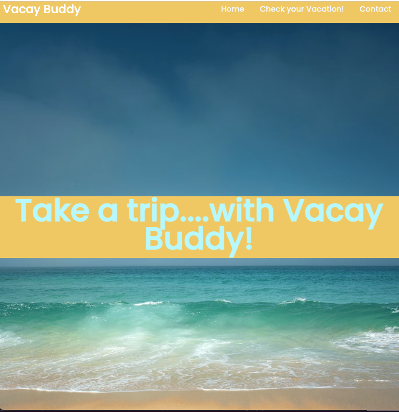
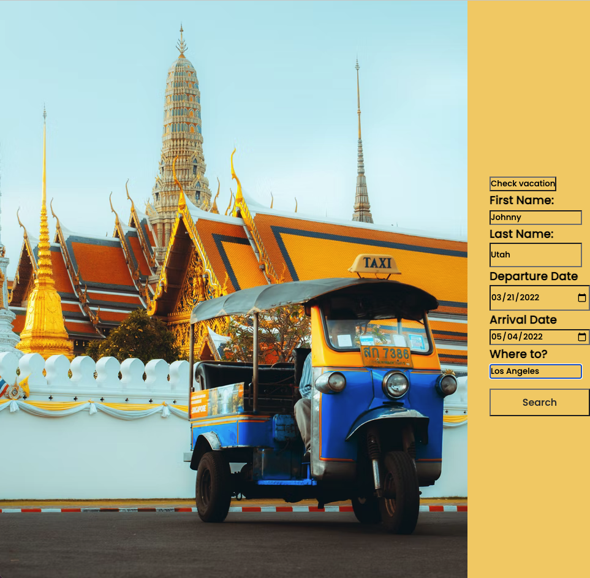
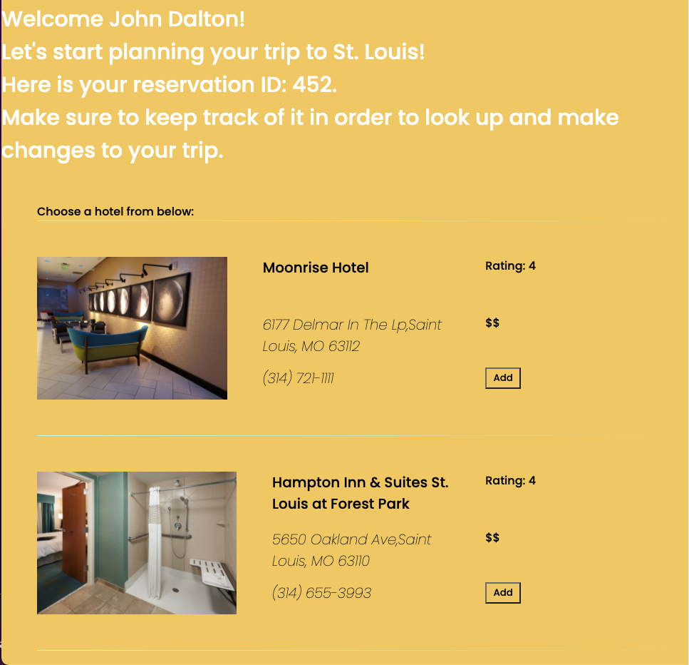
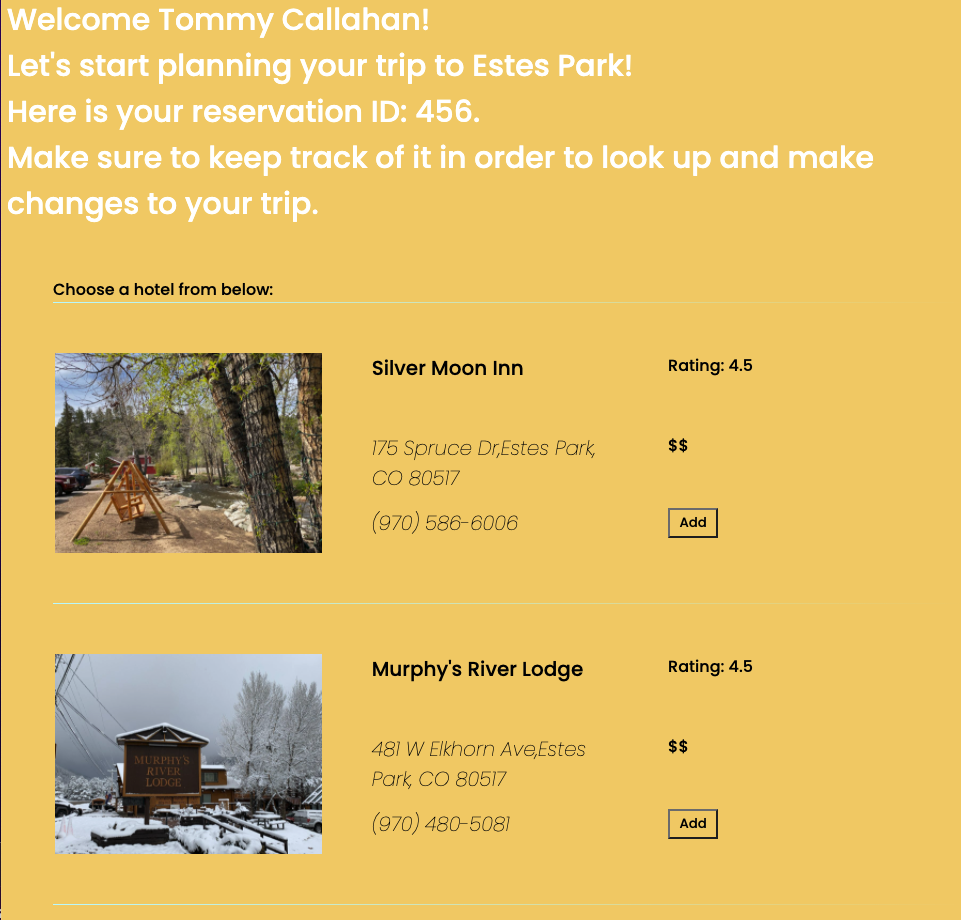
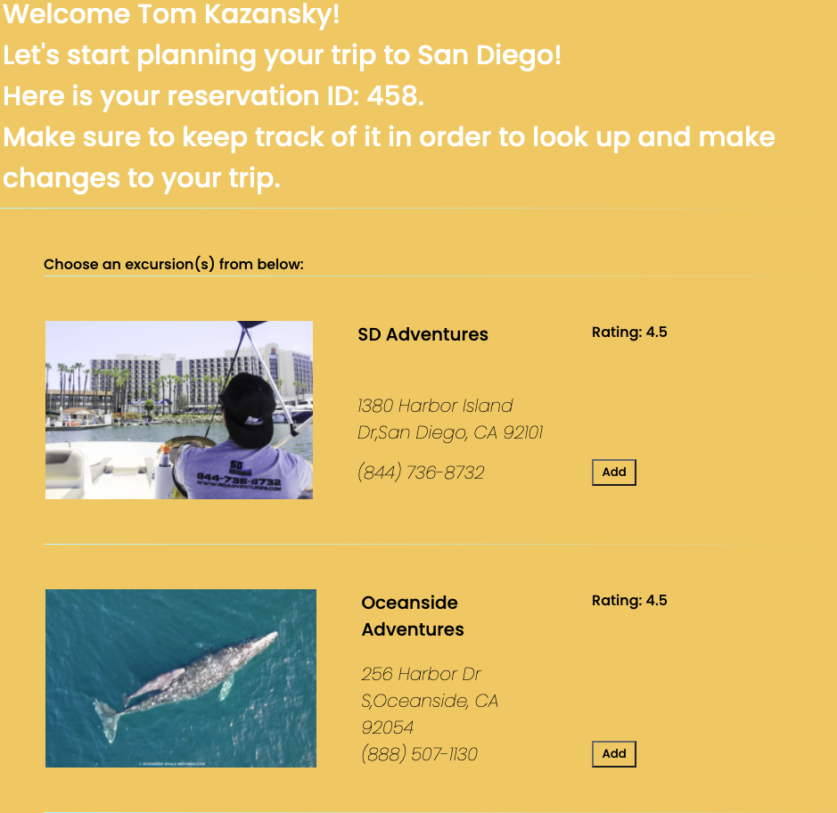
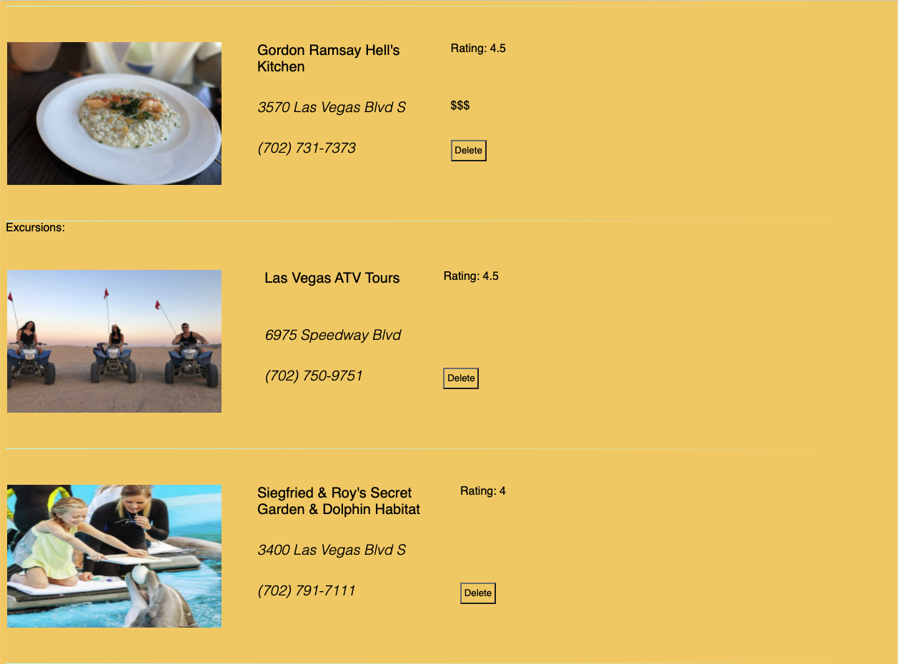
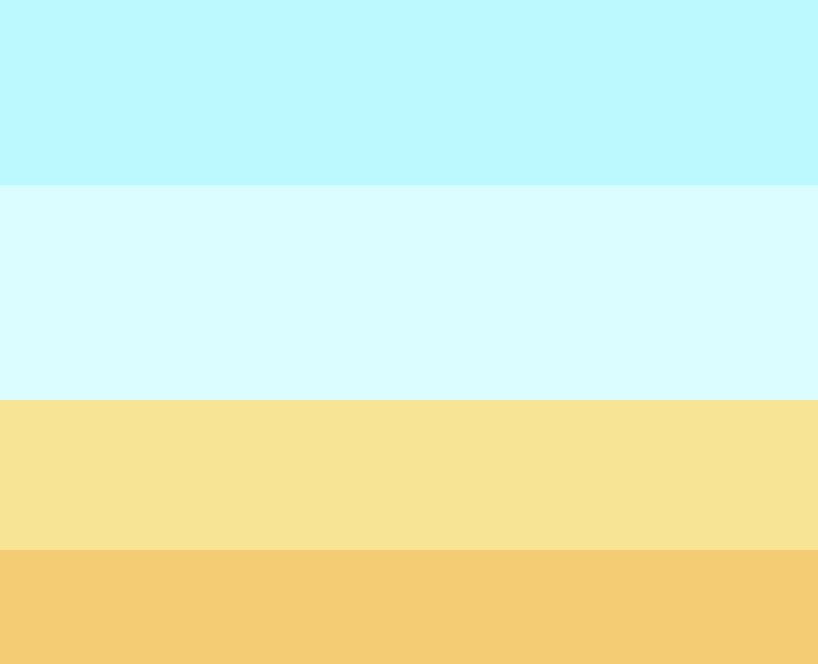
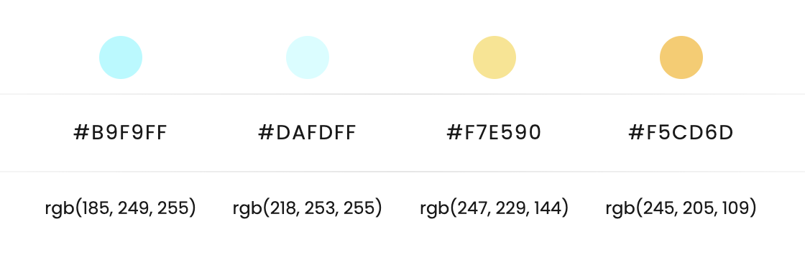

# Vacay Buddy

## Overview:

Vacay Buddy is a website that helps users plan their vacation by providing all relevant information for multiple hotels, restaurants, and excursions in the city that they plan on visiting. Once the user inputs their information, they can simply click the "add" button next to what they are interested in and it will be stored in the database with a reservation ID for that specific vacation. All of the user's choices and vacation details are stored in a database so they can look up their vacation with the reservation ID to read and/or make changes to the trip anytime they need to.

## Technologies used:

- Javascript
- Node.js
- Express.js
- Sequelize ORM
- PostreSQL
- ES6 Template Engine
- CSS

#### API:

- [Yelp Fusion API](https://www.yelp.com/developers/documentation/v3)

## Database schema (with dummy data):

## Screenshots:

## Color Palette:

## Read about our project:

- To read more about our project check out [this blog post](https://dev.to/jareichert/what-nessie-and-a-full-stack-engineer-have-in-common-4n3f)!

#### Built by @ciaracloud and @JAReichert
