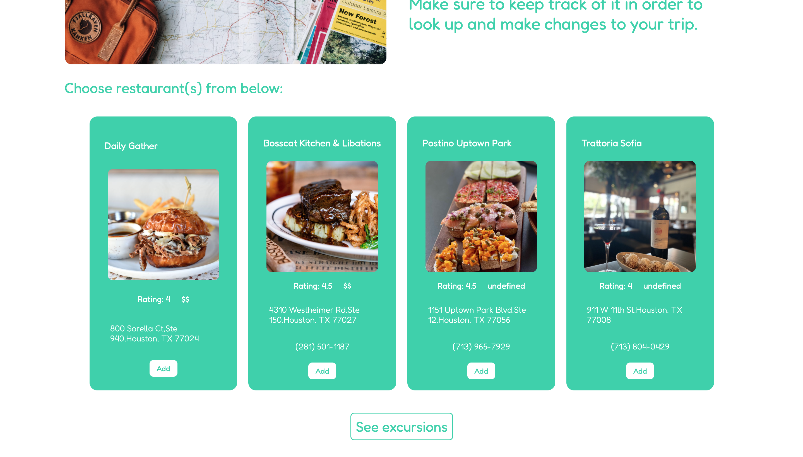
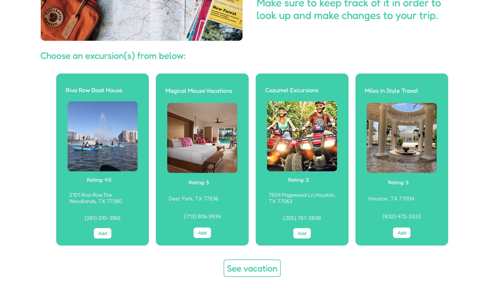

# Vacay Buddy

## Overview:

Vacay Buddy is a website that helps users plan their vacation by providing all relevant information for multiple hotels, restaurants, and excursions in the city that they plan on visiting. Once the user inputs their information, they can simply click the "add" button next to what they are interested in and it will be stored in the database with a reservation ID for that specific vacation. All of the user's choices and vacation details are stored in a database so they can look up their vacation with the reservation ID to read and/or make changes to the trip anytime they need to.

## Technologies used:

- Javascript
- Node.js
- Express.js
- Sequelize ORM
- PostreSQL
- ES6 Template Engine
- CSS

#### API:

- [Yelp Fusion API](https://www.yelp.com/developers/documentation/v3)

## Database schema (with dummy data):

## Screenshots:

### Home Page:

- Creates a vacation in the database with a unique reservation ID:
  

#### Displays user vacation information and gives options to choose from:

- Gathers hotel, restaurants, and excursions data from Yelp API based on the chosen destination

#### Select a hotel:

- Creates a hotel in the database with the unique reservation ID:
  

#### Select restaurant(s):

- Creates restaurants in the database with the unique reservation ID:
  

#### Select excursion(s):

- Creates excursions in the database with the unique reservation ID:
  

## See vacation page:

#### Input reservation ID:

#### Vacation details displayed:

- Uses unique reservation ID to find and display hotel, restaurants, and excursions attached to the vacation in the database:
  

#### Delete from chosen hotel, restaurants, or excursions:

- Deletes from the chosen hotel, restaurants, or excursions in the database:
  

## Read about our project:

- To read more about our project check out [this blog post](https://dev.to/jareichert/what-nessie-and-a-full-stack-engineer-have-in-common-4n3f)!

#### Built by @ciaracloud and @JAReichert
